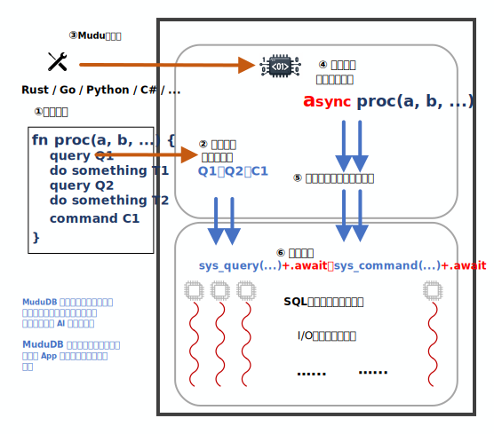

# MuduDB

[English](README.md)

---

MuduDB 是一个数据库系统，它使构建面向数据的应用程序更加容易，并能够将其业务逻辑直接运行在数据库环境内部。

**它目前仍处于一个快速演进的早期演示阶段。**

MuduDB 正在探索一组[创新特性](doc/cn/innovative.cn.md)：使用通用编程语言编写、并运行在数据库内部的 WebAssembly 过程；交互式与过程式统一的执行模型；AI 辅助数据库工程；基于 `io_uring` 和每核 worker 的面向现代硬件的运行时；以及一键 `.mpk` 打包部署。

---

## MuduDB 是什么

MuduDB 将应用逻辑与数据管理带入统一的执行环境。你无需把数据拉取到应用服务器再处理，而是使用通用编程语言编写普通的过程，将其编译为 WebAssembly，并在数据库内核内部、贴近数据的位置运行——所有执行都处在同一事务与调度权威之下。

同一个过程既可以通过客户端以交互方式调用，也可以作为服务端工作流的一部分执行，从而让临时探索与生产逻辑共享同一套模型。

## 核心特性

- **将业务逻辑运行在数据库内部** —— 业务逻辑以 WebAssembly 过程的形式运行在数据库内核中、贴近数据的位置，减少反复的网络往返。
- **一套代码同时用于开发与生产** —— 同一个 Mudu Procedure 既可以在开发阶段以交互方式运行（类似 ORM），也可以部署为服务端过程，无需维护“开发版 vs 生产版”两套代码。
- **使用通用编程语言** —— 使用 Rust 或 AssemblyScript 编写过程，无需学习 PL/pgSQL 等数据库专用存储过程语言。
- **内置 ORM 与类型安全** —— 通过 `Entity` trait 自动将查询结果映射为 Rust 结构体，`sql_stmt!` / `sql_params!` 宏提供编译期 SQL 校验。
- **面向现代硬件的运行时** —— 每核独立 worker、`io_uring` 异步 I/O、无锁/低锁热路径，目标是更低的尾延迟和更好的多核可扩展性。
- **WebAssembly + MPK 打包** —— 过程编译为 WASM，并打包成包含 schema、初始数据和描述符的 `.mpk` 文件，安装后即可运行。
- **微内核 + 插件架构** —— 精简的核心引擎（存储、ACID、查询解析/执行）与可扩展的插件生态。

## 架构

上图展示了 MuduDB 的整体架构。

MuduDB 采用一种内核-运行时架构，将应用逻辑与数据管理带入统一的执行环境。

内核提供核心的正确性基础设施，包括存储、事务处理、查询执行以及执行控制。它并不暴露传统客户端驱动那样宽泛的接口面，而是定义了一组精简的[系统调用](doc/cn/syscall.cn.md)接口，用于完成会话管理与数据访问。

运行时层通过 [WebAssembly Component Model](https://component-model.bytecodealliance.org/) 承载用户定义的过程（WebAssembly）。运行时被刻意设计为被动组件：它不引入自己的调度器，也不定义独立的执行策略。过程执行由内核触发并控制，从而使调度、正确性与数据访问保持在同一个控制边界内。

在手写源码层面，Mudu Procedure 通常以顺序式风格使用通用编程语言编写（①）。与传统数据库专用存储过程语言不同，这些代码也可以通过客户端连接以交互方式直接调用（②）。MuduDB 的工具链能够将这类过程转换为可部署产物：同步源码可以被转换为异步生成形式（③），随后编译为 WebAssembly，并与相关资源（例如 schema 定义和初始数据）一起打包。

在运行时，过程调用（④）会在由内核管理的 worker 线程中贴近数据执行（⑤）。用户过程发出的系统调用会陷入内核，并在内核控制的事务与调度规则下运行（⑥）。这样可以让计算与数据访问保持共置，并减少关键路径上的跨边界交互。

执行围绕“每核一个 worker”的模型组织。每个 CPU 核心对应一个专用工作线程，而 I/O、网络处理以及用户代码执行都通过协作式方式复用在这些 worker 中。这种设计减少了线程间协调、加锁以及抢占式上下文切换，从而提升局部性并降低开销。

## 文档导航

- [文档索引](doc/README.md)
- [如何开始](doc/cn/how_to_start.cn.md)
- [核心概念](doc/cn/concepts.cn.md)
- [第一个 MPK 教程](doc/cn/your_first_mpk.cn.md)
- [部署指南](doc/cn/DEPLOY.md)

## 许可证

MuduDB 采用 [Apache License 2.0](LICENSE) 许可证。
