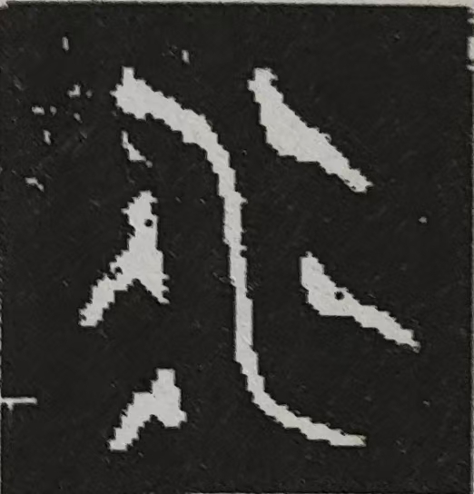

## MuduDB的名字由来
"MuduDB" 的名称源自中国江苏省苏州市吴中区的木渎镇。  

### 木渎镇名字传说 
春秋末期（约公元前500年），吴越两国争霸。越国战败后，越王勾践将绝世美人西施献给吴王夫差。为取悦西施，夫差大兴土木建造宫苑。勾践趁机实施“疲吴之计”，“慷慨”供应大量木材。  

多年间，从越国运来的巨木源源不断堆积于灵岩山下，堵塞河道港口。史载“三年聚材，五年乃成”，终致“积木塞渎”。“木渎”（意为木材堵塞的河道）之名由此诞生。  

### 标志设计理念  
MuduDB 标志将金文中的“木”与“水”  二字进行线条化后，合并到一起：

- **视觉结构**：“木”字悬于“水”之上，象征“木材壅塞河道”的历史典故  
- **色彩寓意**：  
  - “水”为黑（对应五行中水的代表色）  
  - “木”为青（对应五行中木的代表色）  