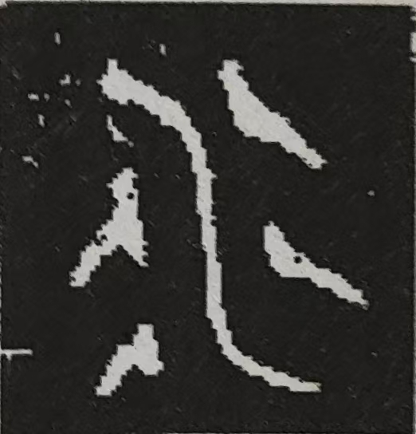

## “MuduDB” 名称的由来

“MuduDB” 这一名称源自中国江苏省苏州市吴中区的木渎镇。

### 木渎镇的历史背景

春秋末期（约公元前 500 年），吴越两国相争。越国战败后，越王勾践将传奇美女西施进献给吴王夫差。为了取悦西施，吴王夫差大兴土木修建宫殿。勾践则借机以“慷慨”之名，持续向吴国输送大量木材，以消耗吴国国力。

多年间，从越国不断运来的木材堆积在灵岩山下，堵塞了河道与港口。史书记载“三年聚材，五年乃成”，最终形成“积木塞渎”（*Jīmù Sèdú*）之景。因此，“木渎”这一名称便由此而来，意为“木材堵塞水道”。

### 标志设计理念

MuduDB 的标志将金文中的“木”和“水”两个字进行艺术化融合：

- **视觉结构**：“木”字位于“水”字之上，象征“木塞水道”的历史典故。
- **色彩寓意**：
  - “水”采用黑色，黑色在五行中对应水。
  - “木”采用青色，青色在五行中对应木。
