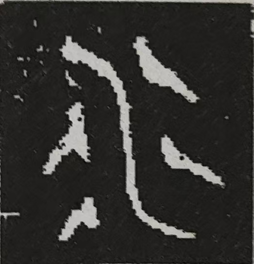

## The Name "MuduDB"

The name "MuduDB" originates from Mudu Town (木渎镇), located in Wuzhong District, Suzhou City, Jiangsu Province, China.

### Historical Background of Mudu Town

During the late Spring and Autumn period (circa 500 BCE), the rival states of Wu and Yue were locked in conflict. After
Yue's defeat, King Goujian of Yue sent the legendary beauty Xi Shi to King Fuchai of Wu as a tribute. To please Xi Shi,
King Fuchai embarked on grandiose palace construction projects. Seizing the opportunity to drain Wu's resources, King
Goujian of Yue "generously" supplied massive quantities of timber for these projects.

Over years, logs shipped continuously from Yue accumulated and clogged the rivers and harbors below Lingyan Mountain.
Historical records describe this as "three years gathering timber, five years completing construction", leading to "
accumulated logs clogging the waterways" (积木塞渎, *Jīmù Sèdú*). Thus, the name "Mudu" (木渎, Wood-Clogged Waterway)
was born.

### Logo Design Philosophy

The MuduDB logo artistically merges ancient bronze script characters for "Wood" (
木)  and "Water" (水) .

- **Visual Structure**: The character for "Wood" appears above "Water", symbolizing the historic "wood clogging the
  waterway".
- **Color Symbolism**:
    - "Water" is rendered in black (black representing the Water element in Wu Xing theory).
    - "Wood" is depicted in azure blue (azure blue representing the Wood element in Wu Xing theory).

---