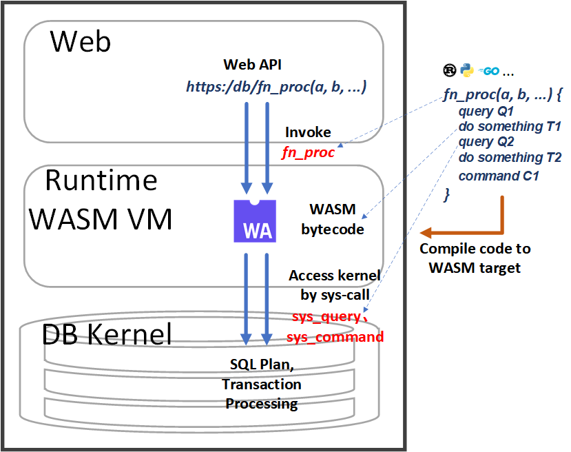

# MuduDB

[English](readme.md)

MuduDB 是一款主要聚焦于 OLTP（联机事务处理）的数据库管理系统

**这个项目目前处于早期开发阶段，仅作演示用。**

它实现一系列创新特性，旨在充分利用现代人工智能与云计算技术，显著提升数据系统开发效率并优化资源利用率。

---
## 架构

---

## MuduDB 创新特性  

### 1. AI 赋能数据库工程  
通过大语言模型(LLM)加速开发周期，自动生成：  
- **实体关系图(ER Diagrams)**  
- **数据定义语言(DDL)脚本**  
- **存储过程与函数**  

### 2. [Mudu过程](doc/cn/procedure.cn.md)

无缝整合两类执行模式：

- **交互式**（ad-hoc事务处理）
- **过程式**（one-shot事务执行）

### 3. 现代硬件优化架构

通过以下技术实现资源效率最大化：

- **异步I/O**（深度优化NVMe/SSD性能）
- **协作并发**（近零开销的轻量级线程调度）

### 4. 微内核架构设计

具备高度模块化与可扩展性：

- **核心引擎**：仅处理基础功能（存储、ACID、查询解析、查询执行）
- **插件生态**：
    - 扩展模块（如JSON/图数据处理）
    - 外部运行时模块（如机器学习推理）
    - 定制化存储引擎

---

## **开发现状**

### 自上而下的开发策略

#### 开发优先级：

1. **开发者工具链**（AI工具、校验工具）
2. **前端层**（SQL接口、ORM集成、运行时环境）
3. **核心引擎**（事务处理核心层）

#### 当前重点：Mudu 运行时

- **开发进展**：正构建 **Mudu 运行时**——该执行环境将统一过程式逻辑与交互式查询

---

## **开源计划**

核心引擎开发完成后，将以 Apache 2.0 开源协议正式发布