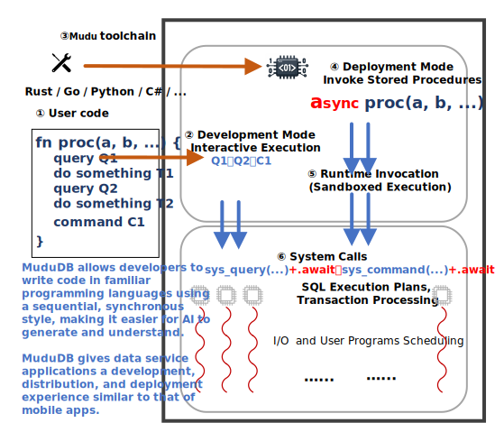

# MuduDB

[汉语](readme.cn.md)

---

MuduDB is a database system that lets you develop data-oriented applications more easily and deploy and run them directly on the database.

**It is currently in an actively developing, early-stage phase for demonstration purposes only.**

It introduces a range of [innovative features](doc/en/innovative.md) that leverage modern AI and cloud
technologies to improve data-system development efficiency and optimize
resource utilization.

---

## Architecture

The figure above illustrates the architecture of MuduDB.

MuduDB adopts a kernel–runtime architecture that collapses the traditional boundary between application logic and data management into a unified execution environment.

The kernel provides the minimal correctness substrate, encompassing storage, transaction processing, and query execution.
Rather than exposing a API connection driver surface, it defines a narrow [system call](doc/en/syscall.md) interfaces.
These interfaces serve as the mechanism for data access, session management.

The runtime layer hosts user-defined procedures(WebAssembly) via the [WebAssembly Component Model](https://component-model.bytecodealliance.org/).
The runtime is intentionally non-scheduling:
it does not introduce independent concurrency or execution policies,
but instead acts as a passive execution engine invoked by the system.
This avoids duplicating scheduling logic across layers and preserves a single locus of control within the kernel.

MuduDB supports only a sequential and synchronous programming model (no concurrency and asynchrony) at the user level.
Developers write procedure-oriented code in general-purpose languages (①),
which is different from traditional stored-procedure, it can be directly invoked through client connections by interactive accessing (②).
MuduDB's toolchain can transforms such procedures into deployable artifacts:
synchronous code is transpiled into asynchronous form (③), then the code would be compiled to WebAssembly, and be packaged together with associated assets (e.g., schema definitions and initial data).

At runtime, procedure invocation (④) can trigger asynchronous execution within the worker thread of the kernel(⑤).
System calls(WASM host implement interface function) issued during execution trap in the kernel, where they are executed under transactional and scheduling control(⑥).
As a result, computation and data access are co-located, eliminating cross boundaries interaction in the critical path.

Execution is organized around a per-core worker model, in which each CPU core is assigned a dedicated worker thread.
All I/O, network handling, and user code execution would be multiplexed within these workers using cooperative scheduling.
This design removes the need for inter-thread synchronization, locking, and preemptive context switching, thereby reducing coordination overhead and improving cache locality.

---

## [How to start](doc/en/how_to_start.md)

---
